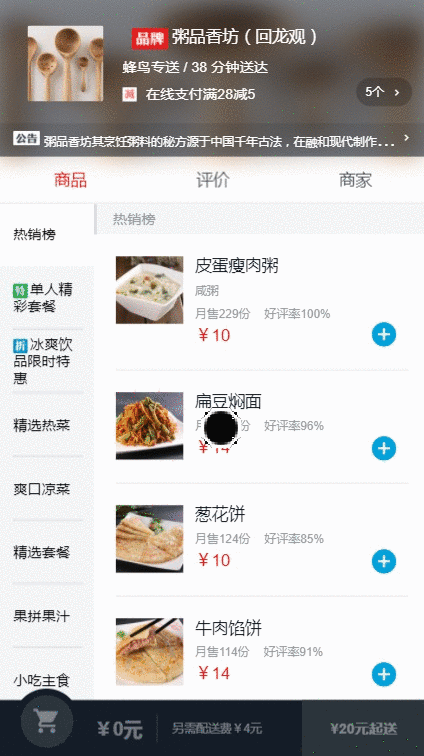
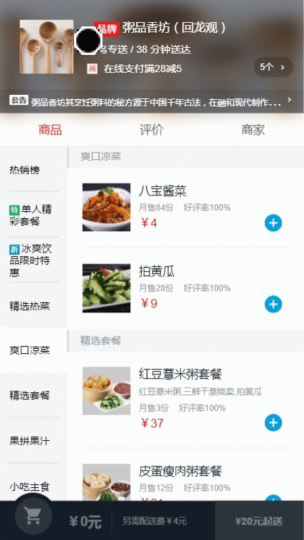
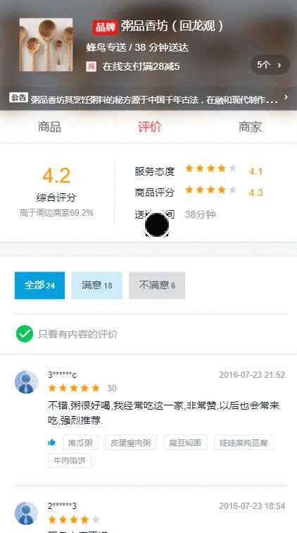
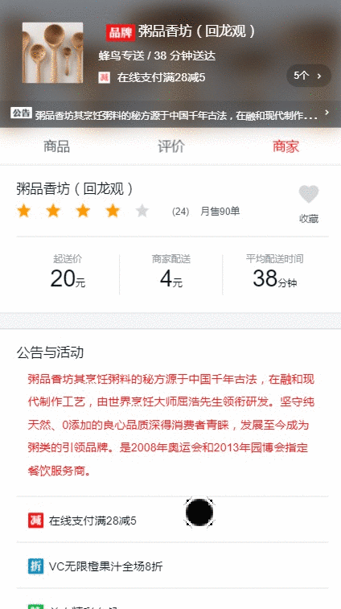

# vue-ele

<p align='center'>
    
</p>

<p align="center">
  
  
</p>

<p align="center">
  
  
</p>

# Libraries

[中文 请点这里](./README-CN.md)

The following are some core dependence

- vue（^2.5.2）
- vue-router（^3.0.1）：The official router for Vue.js
- vue-resource ：The plugin for Vue.js provides services for making web requests
- express ：web framework for Node.js
- stylus ：CSS preprocessor

# Feature

Here are some of the features you may notice

- vue 2.0 + express + stylus
- data mock
- mobile end one pixel
- stricky footer

# Build Setup

```sh
# install dependencies
npm install

# serve with hot reload at localhost:8080
npm run dev

# build for production with minification
npm run build
```

# API

data mock api

```js
  devServer: {
    //  add data mock api
    before(app) {
      app.get('/api/seller', function (req, res) {
        res.json({
          errno: 0,
          data: seller
        })
      })

      app.get('/api/goods', function (req, res) {
        res.json({
          errno: 0,
          data: goods
        })
      })

      app.get('/api/ratings', function (req, res) {
        res.json({
          errno: 0,
          data: ratings
        })
      })

    },
```

- seller `/api/seller`
- goods `/api/goods`
- ratings `/api/ratings`

# Thanks

- [ustbhuangyi](http://coding.imooc.com/class/74.html)
